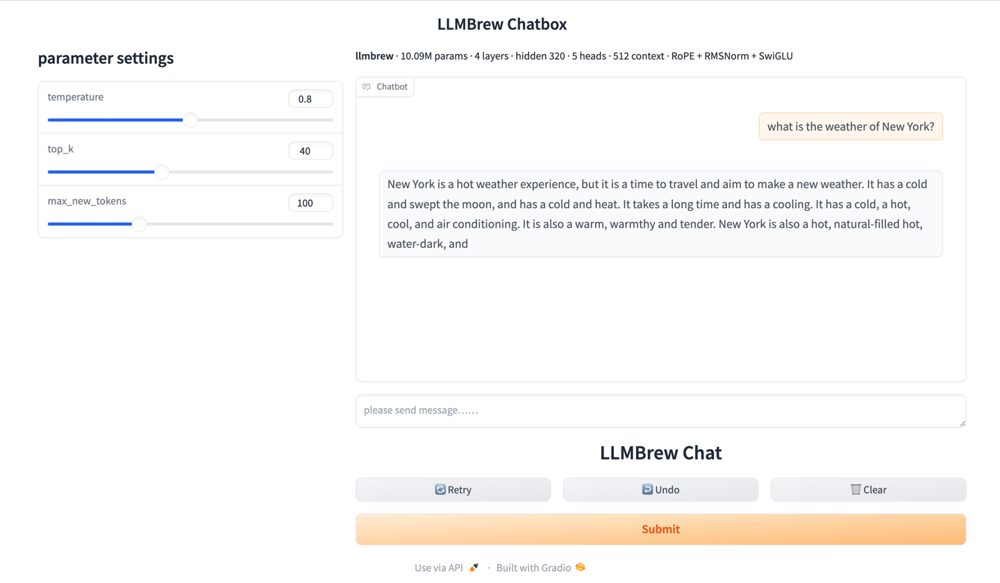

<p align="center">
 
</p>

<h1 align="center">LLMBrew</h1>
<h3 align="center">Brew your own LLM, on your own machine.</h3>

<p align="center">
  
  
  
  
  
  
  
</p>

---

## Train a real LLM on the laptop you already own

**$0 · One night · No GPU · No cloud**

Start it before bed. Wake up to your own language model — and a chat
interface to talk to it.

Every stage is written from scratch in ~2,700 lines of Python: BPE
tokenizer, pretraining, supervised fine-tuning, sampling, and a Gradio
UI. Nothing is imported from `transformers` except the tokenizer runtime.
Attention, RoPE, RMSNorm, SwiGLU, the training loops, the streaming data
pipeline and checkpoint management are all yours to read.

You don't need a GPU. You don't need a cloud account. You don't need to
know what a transformer is before you start — you will by the time you
finish.

> **Set expectations first:** the reference model is 10M parameters. It produces fluent, well-formed sentences that are frequently factually wrong. See [What this model cannot do](#what-this-model-cannot-do) before you start — knowing the ceiling in advance is the difference between a satisfying weekend and a disappointing one.
---
## Talk to your own model



---

## What you need

| | |
| :--- | :--- |
| **Hardware** | Any laptop. CPU only. *(reference run: MacBook, no GPU)* |
| **RAM** | ~8 GB |
| **Disk** | ~2 GB — corpus, tokenizer, checkpoints |
| **Python** | 3.9+ with PyTorch 2.0+ |
| **Total time** | **~11 hours**, unattended |
| **Cost** | **$0** |

### Where the time goes

| Stage | Duration |
| :--- | ---: |
| Tokenizer + encoding | ~15 min |
| **Pretrain** → base model | **6.4 h** |
| **Fine-tune** → chat model | **4.3 h** |
| **Total** | **~11 h (one night)** |

Both training stages checkpoint continuously and restore the best weights automatically, so an interrupted run is never a total loss. Start it before bed, read the logs in the morning.

---

## Quick Start

```bash
git clone https://github.com/guopanjin/llmbrew.git
cd llmbrew
pip install -r requirements.txt
```

**1. Train a tokenizer** *(~10 min)*

```bash
python -m llmbrew.tokenizer.train_tokenizer
```

BPE, 16,000 merges, 7 special tokens. Trained on your own corpus — English, Chinese, code, whatever you point it at.

**2. Encode your corpus** *(~5 min)*

```bash
python -m llmbrew.tokenizer.encode_pretrain_data
```

Documents are densely packed into `uint16` binaries and split into train/validation by content hash, so the split is identical on every machine and every rerun.

**3. Pretrain** *(6.4 h)*

```bash
python examples/example_train_pretrain_model.py
```

**4. Fine-tune** *(4.3 h)*

```bash
python examples/example_train_sft_model.py
```

**5. Talk to it**

```bash
python examples/example_sft_generate_text.py
```
**6. Chat with it**

```bash
python apps/app.py
```

Opens a local Gradio interface at `http://127.0.0.1:7860`.

### Using it from Python

```python
import torch
from llmbrew.model import LLMBrewModel, LLMBrewConfig
from llmbrew.tokenizer import TokenizerUtil

states = torch.load("~/.llmbrew/model_outputs/sft/final_model/sft_model.pt",
                    weights_only=False)

model = LLMBrewModel(LLMBrewConfig(**states["config"].__dict__))
model.load_state_dict(states["model_state_dict"])
model.eval()

tokenizer = TokenizerUtil()
prompt = "<system>you are a helpful assistant.<user>你是谁?<assistant>"
input_ids = torch.tensor([tokenizer.encode(prompt)], dtype=torch.long)

output = model.generate(input_ids,
                        do_sample=True,
                        temperature=0.8,
                        top_k=40,
                        max_new_tokens=100,
                        eos_token_id=tokenizer.eos_id)

print(tokenizer.decode(output[0].tolist()))
```

Every checkpoint carries its own `LLMBrewConfig`, so the architecture is reconstructed from the file. You never hand-specify dimensions when loading.

### Want it smaller or bigger?

Edit `LLMBrewConfig` and rerun. The reference numbers below scale roughly linearly in wall-clock time.

| | Layers | Hidden | Params | Pretrain time |
| :--- | ---: | ---: | ---: | ---: |
| Tiny | 2 | 256 | ~5 M | ~3 h |
| **Reference** | **4** | **320** | **10 M** | **6.4 h** |
| Larger | 8 | 512 | ~30 M | ~20 h |

---

## What you get

### Pretraining

112.3M tokens of English, Chinese and code, two epochs, single CPU.

| | |
| :--- | ---: |
| Tokens seen | 224,153,600 |
| Steps | 4,680 |
| Throughput | ~9.1 K tokens/s |
| Wall-clock | 6.4 h |

| Step | Val loss | Normalized ↓ | PPL |
| ---: | ---: | ---: | ---: |
| 500 | 5.2690 | 0.5443 | 194.22 |
| 1000 | 4.4680 | 0.4616 | 87.18 |
| 2189 | 4.1401 | 0.4277 | 62.81 |
| 3500 | 4.0237 | 0.4157 | 55.91 |
| final | **3.9727** | **0.4104** | **53.13** |

*Normalized loss = `loss / ln(vocab_size)` — the fraction of the random baseline that remains. 0.4104 means the model closed about 59% of the gap between random guessing and perfect prediction.*

Gradient norms stayed between 0.30 and 0.87 for the entire run; clipping at `max_norm=1.0` never fired.

### Fine-tuning

| | |
| :--- | ---: |
| Dataset | Alpaca (51,892 en) + Alpaca-GPT4-zh (48,684 zh) |
| Samples | 100,576 |
| Steps | 1,992 (2 epochs) |
| Wall-clock | 4.3 h |

| Step | Val loss | Normalized ↓ | PPL |
| ---: | ---: | ---: | ---: |
| 200 | 3.4401 | 0.3554 | 31.19 |
| 400 | 3.3570 | 0.3468 | 28.70 |
| final | **3.1488** | **0.3253** | **23.31** |

Validation loss was still improving at the final checkpoint — two epochs did not reach overfitting.

### The behavioural change

The clearest evidence that fine-tuning worked is not the loss curve. **The base model continues your text; the fine-tuned model answers it.**

| Prompt | Base model | After SFT |
| :--- | :--- | :--- |
| `如果明天下雨，我们就` | 必须注意以下几点。<br>1、在《论语》中… | **那么你**可以考虑以下几点： |
| `Explain what machine learning is.` | `- **Example**:`<br>`- **Example**:` … | A machine learning is a machine learning algorithm that can be used to learn from the computer. |

The base model treats the prompt as a fragment to extend. The fine-tuned model addresses the user — "那么**你**可以考虑" — and produces answer-shaped output.

**It also learns when to stop.** The base model never emitted `<eos>` once in 10 test prompts; it hit the token limit every time.

| Decoding | Terminated naturally |
| :--- | ---: |
| Base model | 0 / 10 |
| SFT, greedy | 3 / 11 |
| SFT, `T=0.8, top_k=40` | 4 / 11 |

```
"Water boils at a temperature of"
→ "The temperature of the water boils at a temperature of
   about 350 degrees Fahrenheit."<eos>

"Once upon a time, there was a"
→ "The day was a great day."<eos>
```

Complete sentences, terminated by the model itself.

Full generation logs for every configuration are in [`docs/`](docs/).

---

## What this model cannot do

A 10M-parameter model trained on 224M tokens has hard limits. They are documented here rather than hidden behind a curated demo, because knowing *why* an output is wrong is more useful than being surprised by it.

**Facts are unreliable.** `"中国的首都是"` produces `"中国的首都是中国"`. The pretraining corpus certainly contained the correct answer — the model does not have the capacity to store it. Fine-tuning unlocks capabilities that already exist in the base model; it cannot create knowledge that was never learned.

**No long-range planning.** Raising `max_new_tokens` from 50 to 100 makes output *worse*, not longer. A response that terminates cleanly at 50 tokens degenerates into repetition when given more room. Four layers are enough for local syntax, not for sustaining an argument.

**Fine-tuning erases what pretraining learned.** Before SFT, `def fibonacci(n):` produced a correctly indented function body with a docstring. After SFT it produces a run of quote characters. Alpaca contains almost no code, and two epochs at `lr=2e-5` were enough to overwrite it. This is the clearest demonstration in the project of why SFT data composition matters.

**Decoding strategy matters as much as the weights.** Same model, same prompt:

```
greedy            机器学习是一种机器学习，它能够帮助我们学习机器学习。
                  机器学习是一种机器学习，它能够帮助我们学习机器学习。  ← collapsed

T=0.8, top_k=40   机器学习需要进行机器学习，但是我们需要进行一些建议来确定
                  是否能够自动地完成这些任务。下面是一些详细的描述：
                  1. 提供一个简单的程序：…
```

Greedy decoding is deterministic — once the model enters a high-probability loop it cannot escape. Sampling breaks the cycle at the cost of factual drift. **At this scale there is no setting that is both coherent and correct**; the two failure modes trade against each other. `T=0.8, top_k=40` is the most balanced configuration and is the default.

---

## How it works

```
raw corpus (en / zh / code)
        │
        ├─ train_tokenizer      BPE, vocab 16k, 7 special tokens
        │
        ├─ encode_pretrain_data dense packing, uint16 .bin,
        │                       xxhash deterministic train/val split
        │
        ├─ PretrainDataset      memmap streaming, block-level shuffle
        │
        ├─ PretrainTrainer      grad clipping, EMA loss, checkpoint rotation,
        │                       best-model tracking, warmup scheduler
        │
        ├─ encode_sft_data      chat template, prompt/response boundary,
        │                       jsonl with input_ids + prompt_len
        │
        ├─ SFTTrainer           label masking (-100 on prompt), right padding,
        │                       early stopping
        │
        └─ model.generate()     greedy / temperature / top-k sampling
```

### Architecture

A decoder-only transformer following the LLaMA design family.

| Component | Choice |
| :--- | :--- |
| Positional encoding | **RoPE** (interleaved, rotary) |
| Normalization | **RMSNorm**, Pre-Norm placement |
| Feed-forward | **SwiGLU** |
| Attention | Multi-head causal, scaled by `1/√head_dim` |
| Output head | Weight-tied with input embedding |
| Optimizer | AdamW with decay / no-decay parameter groups |

Reference config: **10.09M params · 4 layers · hidden 320 · 5 heads · FFN 864 · vocab 16k · context 512**.

Embeddings account for 51% of all parameters (5.12M of 10.09M) — at this scale the vocabulary, not the depth, dominates the budget.

### Chat template

```
<system>you are a helpful assistant.<user>{instruction}<assistant>{response}<eos>
```

`<assistant>` belongs to the **prompt** segment — the model is never trained to emit it, since it is always supplied at inference time. Loss is computed only over the response tokens plus the terminating `<eos>`; everything before is masked to `-100`.

---

## Engineering notes

Three things that cost real debugging time. If you are building your own pipeline, these are the ones to get right.

### Attention scaling is not cosmetic

Without the `1/√head_dim` factor, mean normalized attention entropy at initialization is **0.4931** — a single position absorbs ~46% of the weight before any training happens, pushing softmax into saturation and gradients toward zero. With the scale applied: **0.9854**, near-uniform.

The model still trains without it. It just trains to a much worse place, and nothing in the loss curve tells you why.

### Pre-Norm needs a final norm

In Pre-Norm, each block normalizes a *copy* of the residual stream and adds the result back to the un-normalized trunk. That preserves the identity gradient path — the reason Pre-Norm is stable — but it means the trunk itself is never normalized.

Measured residual std across depth:

| Depth | Input → Output | Growth |
| :--- | :--- | ---: |
| 4 layers | 0.010 → 0.554 | 55× |
| 12 layers | 0.010 → 1.073 | 107× |

Every consumer of the trunk normalizes on read — except `lm_head`. A single `RMSNorm` before the output projection is what keeps logits bounded, and it is the only place one is needed.

### Data order will silently destroy your run

The first pretraining attempt ran 28.7 hours and produced a validation loss that went **up**: `5.2924 → 6.0449`. Training loss meanwhile fell off a cliff — 0.87 nats in 100 steps.

The model was fine. The corpus was concatenated by language (`en → zh → code`) and the dataset read it strictly sequentially. The loss cliff landed at step 4090, which is **86.8% through the first epoch** — exactly where the reader entered the final single-domain segment. Not overfitting. Catastrophic forgetting.

Measured domain purity per batch:

| | Mean domain purity |
| :--- | ---: |
| Sequential read | 98.4% |
| Block shuffle | **37.9%** |

(33.3% is perfect mixing for three domains.) After the fix, all seven validation checkpoints decreased monotonically, including across the epoch boundary.

**If you bring your own corpus, shuffle it.** This failure mode is invisible until you have burned a full training run.

---

## Project layout

```
llmbrew/
├── config/           path constants, project root resolution
├── constants/        special token definitions
├── dataset/          PretrainDataset (memmap streaming, block shuffle)
│                     SFTDataset (jsonl, label masking)
├── model/
│   ├── layers/       attention · RoPE · RMSNorm · SwiGLU · decoder block
│   ├── optimizers/   AdamW decay groups · linear / cosine / WSD schedulers
│   └── llmbrew_model.py
├── tokenizer/        BPE training · corpus encoding · TokenizerUtil
├── trainer/          PretrainTrainer · SFTTrainer · EarlyStop
└── utils/            device · logging · xxhash · common

examples/             four runnable end-to-end scripts
tests/                10 test modules
docs/                 generation baselines for every configuration
artifacts/tokenizer/  trained 16k BPE tokenizer
```

### Design notes

**Checkpoints are self-describing.** Every saved model carries its `LLMBrewConfig`, so loading never requires hand-matching architecture parameters.

**Two save formats.** `final_model` holds weights + config (~40 MB, for downstream use). `checkpoints` and `best` additionally hold optimizer and scheduler `state_dict()` plus step counters (~120 MB, for resuming). Optimizer state is always stored as `state_dict()`, never as the object — pickling an optimizer serializes the parameter tensors a second time and, on reload, rebinds to orphan tensors that are no longer the model's.

**Deterministic data splits.** Train/validation partitioning uses xxhash of document content rather than random shuffling, so the split is stable across reruns and machines.

**Checkpoint rotation is save-then-delete.** The new file must land on disk before any old one is removed, so an interrupted write never leaves you with zero checkpoints.

---

## License

MIT — see [LICENSE](LICENSE).

## Citation

```bibtex
@software{llmbrew2026,
  author = {Guopan Jin},
  title  = {LLMBrew: Brew your own LLM, on your own machine},
  year   = {2026},
  url    = {https://github.com/guopanjin/llmbrew}
}
```